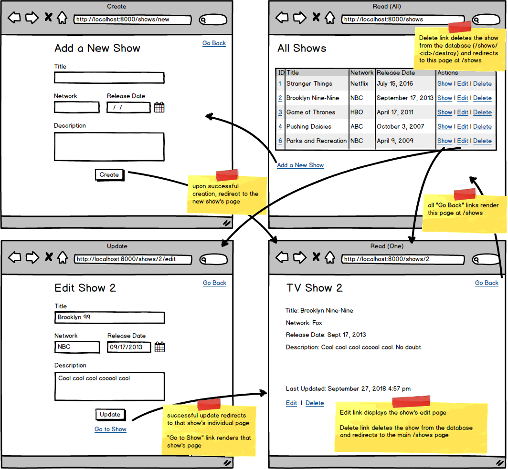
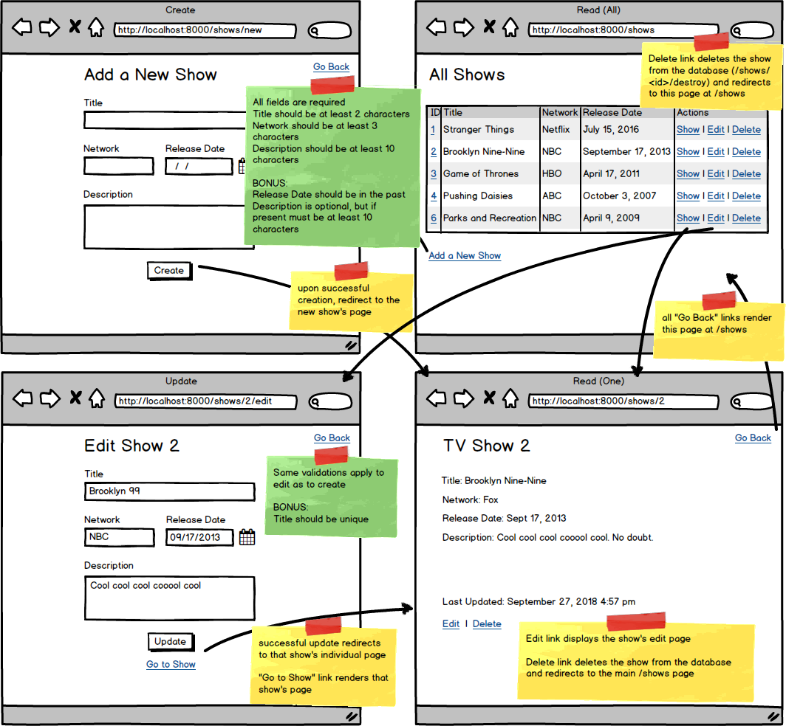

# Python_Semi_Restful_TV_Show
A Python full CRUD for TV show information management
Functionalities:
- [x] /shows/new- GET - method should return a template containing the form for adding a new TV show
- [x] /shows/create - POST - method should add the show to the database, then redirect to /shows/<id>
- [x] /shows/<id> - GET - method should return a template that displays the specific show's information
- [x] /shows - GET - method should return a template that displays all the shows in a table
- [x] /shows/<id>/edit - GET - method should return a template that displays a form for editing the TV show with the id specified in the url
- [x] /shows/<id>/update - POST - method should update the specific show in the database, then redirect to /shows/<id>
- [x] Root route redirect to /shows
- [x] Validate the Add a TV Show form to ensure all fields are populated appropriately before adding to the database.
- [x] Display errors on the Add a TV Show form if the information is invalid.
- [x] Validate the Edit Show form with the same validations as creation.
- [x] Display errors on the Edit Show form if the information is invalid.
- [x] Ensure the Release Date is in the past.
- [x] Allow the description to be optional. If a description is provided, though, it should still be at least 10 characters.
- [x] Validate that a TV show with that title does not already exist in the database before creating or updating.

